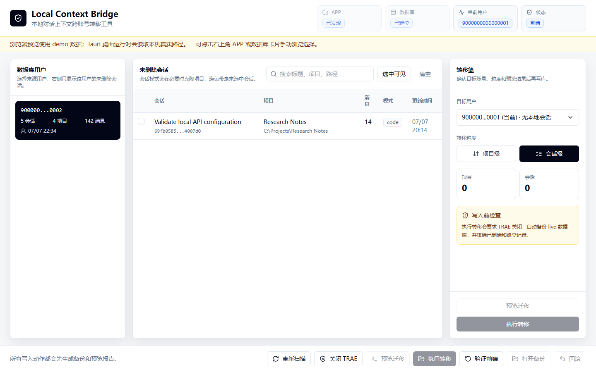

# Local Context Bridge


Local Context Bridge is a local-first Windows desktop app for restoring and selectively moving TRAE SOLO CN conversation context between accounts on the same machine.

It is built for a simple moment: you changed accounts, but the useful projects and conversations are still in your local database. Local Context Bridge discovers the local files, shows every database user, lets you pick the projects or sessions you want, creates a backup, previews the migration, and writes the selected context back to the current account.

> Independent community project. Local Context Bridge is not affiliated with, endorsed by, or maintained by TRAE.



## Download

Get the latest desktop build from [GitHub Releases](https://github.com/Wyy326/local-context-bridge/releases/latest).

| Asset | Best for | Notes |
| --- | --- | --- |
| `Local-Context-Bridge-v0.1.1-Windows-Portable.zip` | Complete portable package | The all-in-one archive. Unzip it and run the desktop executable. Includes README, license, and release notes. |
| `Local-Context-Bridge-v0.1.1-Windows-x64-setup.exe` | Most Windows users | NSIS installer with a familiar setup wizard. |
| `Local-Context-Bridge-v0.1.1-Windows-x64.msi` | Managed or enterprise-style installs | MSI package for Windows installer workflows. |

Early builds are unsigned, so Windows SmartScreen may show a warning. The app is local-only and does not upload databases, logs, account IDs, or telemetry.

## Why It Exists

Modern AI coding tools keep a lot of useful working memory in local context: project metadata, chat sessions, message history, work modes, and local workspace paths. When an account switch breaks the visible frontend state, that context can still exist locally but become hard to reach.

Local Context Bridge makes that state visible again and turns account-level recovery into a controlled desktop workflow instead of a manual database edit.

## What It Does

| Capability | What happens |
| --- | --- |
| App discovery | Finds TRAE SOLO CN from running processes, uninstall registry entries, common install paths, and manual selection. |
| Database discovery | Finds the local `database.db` in the TRAE app-data directory, with manual picker fallback. |
| User mapping | Shows all database user IDs and marks the current-login candidate found from local logs. |
| Selective transfer | Moves selected projects or individual sessions to the target user. |
| Safe preview | Builds a transfer plan before writeback and explains expected database changes. |
| Backup first | Copies `database.db`, `database.db-wal`, and `database.db-shm` before applying changes. |
| Deleted-session guard | Excludes sessions where `chat_session.deleted_at != 0` by default. |
| Frontend verification | Provides verification hooks for checking whether TRAE can reload the transferred sessions. |

## Product Flow

1. Launch Local Context Bridge.
2. Confirm the top cards: app path, database path, current user, and status.
3. If discovery fails, click the app or database card and browse manually.
4. Pick a source user from the left rail.
5. Select projects or sessions from the center table.
6. Confirm the target user in the right panel.
7. Preview the transfer plan.
8. Close TRAE SOLO CN and apply the transfer.
9. Reopen TRAE and verify that the conversations are visible.

## Safety Model

Local Context Bridge is designed around conservative local recovery:

- No cloud sync.
- No telemetry.
- No network upload.
- No deleted-session recovery by default.
- No message, turn, or history ID rewriting.
- No live write before preview.
- No live write without creating a backup first.
- TRAE SOLO CN should be closed before writeback.

You are responsible for using this tool only on local data that you are allowed to access.

## Discovery Logic

The app path is discovered from:

1. Running `TRAE SOLO CN` process path.
2. Windows uninstall registry entries.
3. Start menu and common installation locations.
4. Manual `TRAE SOLO CN.exe` picker.

The database path is discovered from:

1. `%APPDATA%\TRAE SOLO CN\ModularData\ai-agent\database.db`.
2. Manual `database.db` picker.

When a user manually chooses a database matching:

```text
...\TRAE SOLO CN\ModularData\ai-agent\database.db
```

the app derives the related app-data and log directories from that path.

## Transfer Behavior

Project mode updates the owner user for selected projects.

Session mode moves only selected sessions:

- If all active sessions under a project are selected, the operation becomes a project-level transfer.
- If only part of a project is selected, the app reuses a matching target-user project or clones the project row.
- Cloned projects keep the original name, path, source, workspace, and work mode.
- `chat_message`, `chat_turn`, and `history_v2` keep their original `session_id`; they follow the moved session naturally.

## Architecture

Local Context Bridge uses a small desktop shell with the database-sensitive logic kept in Rust:

```text
.
├─ src/                 React, Vite, TypeScript UI
├─ src-tauri/           Tauri commands and Windows packaging
├─ crates/trae_core/    Rust discovery, database, backup, transfer, and crypto logic
├─ docs/                Architecture notes, release notes, and public assets
└─ .github/workflows/   Windows release build workflow
```

Core stack:

- Tauri v2
- React + Vite + TypeScript
- Rust workspace
- SQLite-oriented migration planner
- Tailwind CSS, Radix primitives, lucide-react, TanStack Table

## Development

Prerequisites:

- Windows 10/11
- Node.js 22+
- Rust stable
- WebView2 Runtime

Install dependencies:

```powershell
npm install
```

Run the desktop app in development:

```powershell
npm run tauri:dev
```

Run checks:

```powershell
cargo test -p trae_core
npm run build
```

Build Windows bundles:

```powershell
npm run tauri:build
```

## Roadmap

- Code signing for smoother Windows installs.
- Broader fixture coverage for schema changes.
- More explicit frontend verification reports.
- Provider abstraction for additional local-context apps.
- Safer rollback UX with richer backup metadata.

## License

Apache-2.0
